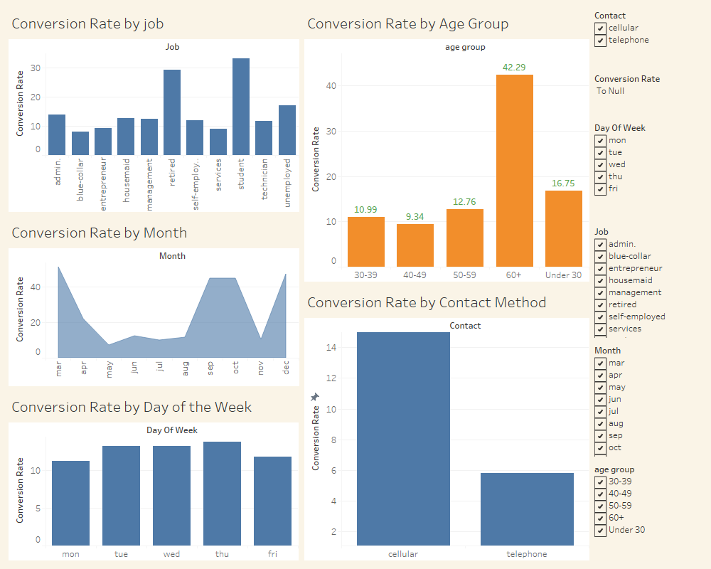

# **CRM Campaign Optimization Dashboard**

## **Project Overview**
This project analyzes a bank's marketing campaign dataset to derive actionable insights and build an interactive dashboard in Tableau. The dataset contains demographic, campaign, and economic details for clients, and the goal is to optimize marketing strategies based on key performance indicators (KPIs).

---

## **Objectives**
- Calculate and analyze key KPIs such as Conversion Rate, Contact Efficiency, and Campaign Efficiency.
- Understand conversion patterns across various demographics (job, age, marital status, etc.).
- Evaluate the efficiency of different contact methods (cellular vs. telephone).
- Identify high-performing campaigns and suggest optimizations.
- Visualize the data with an interactive Tableau dashboard.

---

## **Key Performance Indicators (KPIs)**
Key performance indicators were chosen to evaluate the effectiveness of marketing campaigns across multiple dimensions. These KPIs focus on conversion efficiency, demographic insights, and campaign success rates, which are critical for data-driven decision-making. By analyzing these metrics, businesses can refine their strategies to maximize client engagement and improve return on investment.

### **1. Conversion Rate**
- **Definition**: Percentage of clients who subscribed to the campaign.
- **SQL Query**:
  ```sql
  SELECT 
      job, 
      COUNT(*) AS total_clients, 
      SUM(CASE WHEN y = 'yes' THEN 1 ELSE 0 END) AS conversions, 
      ROUND((SUM(CASE WHEN y = 'yes' THEN 1 ELSE 0 END) * 100.0 / COUNT(*)), 2) AS conversion_rate
  FROM CRM_Campaign_Optimization
  GROUP BY job;
  ```

---

### **2. Contact Method Efficiency**
- **Definition**: Conversion rate segmented by contact method.
- **SQL Query**:
  ```sql
  SELECT 
      contact,
      COUNT(*) AS total_contacts,
      SUM(CASE WHEN y = 'yes' THEN 1 ELSE 0 END) AS conversions,
      ROUND((SUM(CASE WHEN y = 'yes' THEN 1 ELSE 0 END) * 100.0 / COUNT(*)), 2) AS contact_method_efficiency
  FROM CRM_Campaign_Optimization
  GROUP BY contact;
  ```

---

### **3. Success Rate by Job and Contact Method**
- **Definition**: Conversion rate segmented by job and contact method.
- **SQL Query**:
  ```sql
  SELECT 
      contact,
      job,
      COUNT(*) AS total_contacts,
      SUM(CASE WHEN y = 'yes' THEN 1 ELSE 0 END) AS conversions,
      ROUND((SUM(CASE WHEN y = 'yes' THEN 1 ELSE 0 END) * 100.0 / COUNT(*)), 2) AS success_rate
  FROM CRM_Campaign_Optimization
  GROUP BY contact, job;
  ```

---

### **4. Contact Duration Analysis**
- **Definition**: Average call duration and conversion efficiency by contact method.
- **SQL Query**:
  ```sql
  SELECT 
      contact,
      AVG(duration) AS avg_duration,
      SUM(CASE WHEN y = 'yes' THEN duration ELSE 0 END) / NULLIF(SUM(CASE WHEN y = 'yes' THEN 1 ELSE 0 END), 0) AS avg_conversion_duration
  FROM CRM_Campaign_Optimization
  GROUP BY contact;
  ```

---

### **5. Repeat Customers Efficiency**
- **Definition**: Conversion rate for repeat customers vs. new customers.
- **SQL Query**:
  ```sql
  SELECT 
      contact,
      is_repeat_customer,
      COUNT(*) AS total_clients,
      SUM(CASE WHEN y = 'yes' THEN 1 ELSE 0 END) AS conversions,
      ROUND((SUM(CASE WHEN y = 'yes' THEN 1 ELSE 0 END) * 100.0 / COUNT(*)), 2) AS conversion_rate
  FROM CRM_Campaign_Optimization
  GROUP BY contact, is_repeat_customer;
  ```

---

### **6. Conversion Rate by Age Group**
- **Definition**: Conversion rate segmented by age groups.
- **SQL Query**:
  ```sql
  WITH AgeGroup AS (
      SELECT *,
          CASE 
              WHEN age < 30 THEN 'Under 30'
              WHEN age BETWEEN 30 AND 39 THEN '30-39'
              WHEN age BETWEEN 40 AND 49 THEN '40-49'
              WHEN age BETWEEN 50 AND 59 THEN '50-59'
              ELSE '60+'
          END AS age_group
      FROM CRM_Campaign_Optimization
  )
  SELECT 
      age_group,
      COUNT(*) AS total_clients,
      SUM(CASE WHEN y = 'yes' THEN 1 ELSE 0 END) AS conversions,
      ROUND((SUM(CASE WHEN y = 'yes' THEN 1 ELSE 0 END) * 100.0 / COUNT(*)), 2) AS success_rate
  FROM AgeGroup
  GROUP BY age_group;
  ```

---

### **7. Campaign Efficiency**
- **Definition**: Conversion efficiency by campaign.
- **SQL Query**:
  ```sql
  SELECT 
      campaign, 
      COUNT(*) AS total_contacts, 
      SUM(CASE WHEN y = 'yes' THEN 1 ELSE 0 END) AS conversions, 
      ROUND((SUM(CASE WHEN y = 'yes' THEN 1 ELSE 0 END) * 100.0 / COUNT(*)), 2) AS campaign_efficiency
  FROM CRM_Campaign_Optimization
  GROUP BY campaign;
  ```

---

## **Insights from Tableau Dashboard**
1. **Conversion Rate by Job**:
   - Retired individuals have the highest conversion rate, followed by students. These insights suggest prioritizing campaigns for retired clients.
   - Blue-collar jobs show the lowest conversion rate, indicating a need for personalized messaging or alternate strategies.

2. **Conversion Rate by Age Group**:
   - The 60+ age group shows the highest success rate (42.29%). Campaigns targeting older demographics should highlight security, savings, and retirement benefits.
   - Younger age groups (30-39) have a relatively low success rate, indicating the need for engaging campaigns tailored to their preferences, like flexible terms or tech-savvy features.

3. **Contact Method Efficiency**:
   - Cellular contacts outperform telephone in conversion rate, suggesting a focus on mobile-friendly campaigns and optimized scripts for cellular communication.

4. **Conversion Rate by Month**:
   - Campaigns in March, September, and December perform best. These months could correlate with specific events or seasonal behavior, indicating opportunities for targeted offers.
   - Campaigns in summer months (May, June, July) show lower success, suggesting a review of messaging or incentives during these months.

5. **Repeat Customers**:
   - Repeat customers have a higher success rate, emphasizing the value of retargeting loyal clients. Businesses can utilize loyalty programs and personalized follow-ups to enhance conversions.

---

## **Repository Structure**
1. **SQL Scripts**:
   - Includes all KPI calculation queries.

2. **Processed Dataset**:
   - Cleaned and segmented CSV file: `processed_bank_data.csv`.

3. **Tableau Dashboard**:
   - `.twbx` file for the interactive visualization.

4. **README.md**:
   - Detailed explanation of the project.

---

## **Screenshots of Tableau Dashboard**


---
